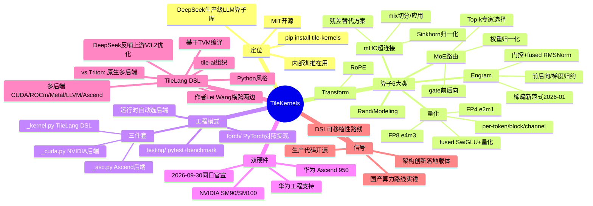

# TileKernels 调研

> DeepSeek 开源的高性能 LLM 算子库：数十个生产级 GPU/NPU 算子，全部用 TileLang DSL 编写，性能接近硬件上限，MIT 协议。

- 仓库：[deepseek-ai/TileKernels](https://github.com/deepseek-ai/TileKernels)
- 首次公开：2026-04-22（GitHub 建仓）；Ascend 后端 2026-09-30 官宣
- License：MIT · 安装：`pip install tile-kernels`
- 作者：16 人，均为 `@deepseek.com` 邮箱

## 一句话

TileKernels 是 DeepSeek 把**自己内部训练和推理正在用的**高性能算子开源出来的合集——MoE 路由、FP8/FP4 量化、Engram 门控、超连接（mHC）、RoPE 等 LLM 训推核心算子，全部用 TileLang 这一 DSL 实现，一份代码同时跑 NVIDIA GPU 和华为 Ascend NPU。

## 包含的算子（6 大类）

| 类别 | 内容 |
|---|---|
| MoE Routing | Top-k 专家选择与打分、正权归一化，含前向/反向 gate kernel |
| Quantization | per-token / per-block / per-channel 的 FP8（e4m3）、FP4（e2m1）量化与反量化，fused SwiGLU+量化、前后向 norm |
| Engram | Engram 门控 kernel（fused RMSNorm）、前向/反向、权重梯度归约、hash、sinkhorn |
| mHC（Manifold HyperConnection） | 超连接 kernel：Sinkhorn 归一化、mix 切分/应用、expand、pre/post |
| Transform | RoPE 旋转位置编码 |
| Rand / Modeling | randn 随机数 kernel；Engram gate 的 `torch.autograd.Function` 高层封装 |

其中 **Engram** 是 DeepSeek 2026-01 提出的稀疏新范式（*Conditional Memory via Scalable Lookup: A New Axis of Sparsity*），**mHC** 是残差连接的替代方案——这两个都是 DeepSeek 自己的架构创新，TileKernels 是它们的落地载体。

## 代码组织：三件套模式

每个算子都是统一的三文件结构，外加 PyTorch 对照实现：

```
tile_kernels/quant/
├── per_token_cast_kernel.py   # TileLang DSL 写的算子本体（硬件无关）
├── per_token_cast_cuda.py     # NVIDIA 后端（SM90/SM100, CUDA 13.1+）
├── per_token_cast_asc.py      # Ascend 后端（Ascend 950, CANN 9.2.0+）
tile_kernels/torch/            # PyTorch reference 实现，用于正确性对照
tile_kernels/testing/          # pytest 正确性 + benchmark 工具链
```

运行时按硬件自动选择后端，Python API 完全一致。`config.py` 里有 `is_ascend()`、`get_num_vec_cores()` 这类后端探测逻辑。

## 双后端：NVIDIA + 华为 Ascend

- 2026-09-30 当天官宣 Ascend 支持，**和 TileLang 官宣 Ascend 950 后端是同一天**——明显是协同推进的。
- README 致谢里专门感谢了华为的技术支持和工程协助。
- 信号很直白：DeepSeek 的生产算子栈正在做**国产硬件路线**，而且不是"能跑就行"，是和 NVIDIA 同等优化的双后端。

## TileLang：为什么不用 Triton / 手写 CUDA

[TileLang](https://github.com/tile-ai/tilelang)（tile-ai 组织，2024-10 成立）是一个 Python 风格的 DSL，编译器基于 TVM：

| | Triton | TileLang |
|---|---|---|
| 出处 | OpenAI | tile-ai（主要作者 Lei Wang） |
| 设计起点 | CUDA 为主，后补 AMD/Intel | 第一性多后端：CUDA / ROCm / Metal / LLVM(CPU) / Ascend NPU |
| 编译器 | 自研 | 基于 TVM |
| 定位 | GPU kernel DSL | GPU/CPU/NPU 通用 kernel DSL |

几个值得注意的连接：

1. **Lei Wang**（GitHub @LeiWang1999）是 TileLang 的第一大贡献者，同时也是 TileKernels 引用格式里的最后一位作者（`lei@deepseek.com`）——DeepSeek 的 kernel 负责人横跨两边。
2. 2026-07，TileLang 上游合入过 "DeepSeek V3.2 sparse MLA backward" 和 "DeepSeek V3.2 top-k optimization"（~1.9× 提升）——DeepSeek 一边用一边往上游反哺。
3. 对 DeepSeek 来说，押注 TileLang 而非手写 CUDA/Triton，核心收益是**算子可移植性**：同一份 DSL 代码，编译到 Hopper/Blackwell 和 Ascend 950 上都能打出接近硬件上限的性能。

## 为什么值得关注

1. **生产代码开源**：README 明确说"全部算子已用于我们的内部训练与推理任务"——这是 DeepSeek 真实训推栈的一部分，不是 demo。
2. **架构创新的载体**：Engram、mHC 这类新范式，光有论文不够，TileKernels 是它们能落到大规模训练里的工程基础。
3. **国产算力路线实锤**：Ascend 950 双后端 + 华为工程支持，配合 3FS/DSec 这些 infra 开源，DeepSeek 的全栈正在把"去 NVIDIA 化"做成可复制的工程。
4. **DSL 路线的胜利**：当算子数量到"数十个"且要跨两种完全不同的硬件时，手写 CUDA 的维护成本爆炸，TileLang 这种"一次编写、多硬件编译"的路线是必然选择。

## 使用要求

- Python 3.12+，PyTorch 2.13+，TileLang 0.1.15+
- NVIDIA：SM90/SM100 架构 GPU（Hopper/Blackwell），CUDA Toolkit 13.1+
- Ascend：Ascend 950 NPU，CANN 9.2.0+

## 思维导图



## 引用

```bibtex
@misc{tilekernels,
  title={TileKernels},
  author={Xiangwen Wang, Chenhao Xu, Huanqi Cao, Luotian Huang, Yuxuan Zhou, Weilin Zhao, Rui Tian, Anyi Xu, Fucong Dai, Kuai Yu, Ruifan Xu, Yi Qian, Shengyuan Jia, Chenggang Zhao, Wei Zhang and Lei Wang},
  year={2026},
  publisher={GitHub},
  howpublished={\url{https://github.com/deepseek-ai/TileKernels}},
}
```

*调研日期：2026-09-30。内容基于公开仓库 README、代码结构与 TileLang 上游信息整理。*
